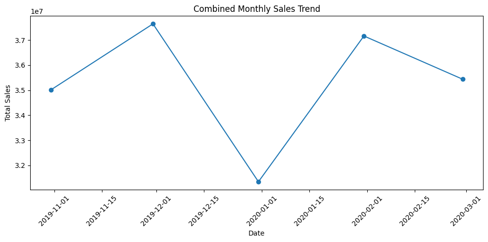

# E-Commerce Analysis Project

Welcome to the E-Commerce Analysis Project repository! This project involves analyzing an e-commerce dataset to gain insights into sales, customer behavior, and product performance.

## Project Overview

- **Objective:** Analyze e-commerce data to derive insights and make data-driven decisions.
- **Tools Used:** Python, Pandas, Matplotlib, Seaborn, Tableau.
- **Data Source:** [Link to Dataset](https://www.kaggle.com/datasets/mkechinov/ecommerce-events-history-in-cosmetics-shop)

## Report

Check out the detailed [Project Report](Report(Readme).pdf) for in-depth analysis, methodologies, and insights.

## Visualizations

Here are some visualizations from the analysis:

### Sales Funnel Analysis

### Daily Conversion Rate Tracking

### Product Performance Analysis

### Monthly Sales Trend

## How to Use

1. Clone this repository.
2. Install required dependencies using `pip install -r requirements.txt`.
3. Review the [Project Report](link_to_your_report.pdf) for detailed insights.
4. Explore the visualizations in the `images` folder.

Feel free to reach out with any questions or feedback!

